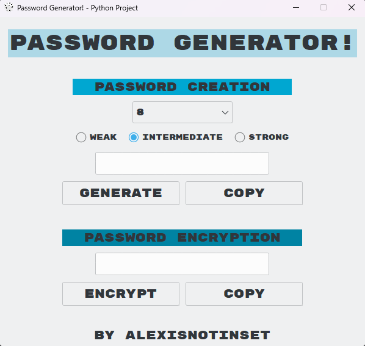

# 🔐 Password Generator & Encryptor (Python)

A graphical **Password Generator and Encryptor** built with Python and Tkinter.  
This application allows users to generate passwords of varying strength and length, then encrypt them using a simple date-based cipher.

---

## ✨ Features

### Password Generator
- Choose password length: **4, 6, 8, 10, or 12**
- Select strength:
  - **Weak** – lowercase letters
  - **Intermediate** – mixed case letters
  - **Strong** – letters, numbers, and symbols
- One-click **copy to clipboard**
- Visual feedback when copying

### Password Encryptor
- Encrypts any password using a **dynamic encryption key**
- Encryption key is based on the **current day and month**
- Copy encrypted passwords instantly
- Simple character-shifting cipher
- Password encryption is based on the **digits string** from the generator

---

## 🛠 Technologies Used

- **Python 3** (required)
- **Tkinter** (built-in GUI)
- **ttkthemes** (UI theming)
- **random** (built-in, password generation)
- **datetime** (built-in, encryption key generation)

---

## ▶️ How to Run

1. Make sure Python 3 is installed
2. Install the external dependency:
   ```bash
   pip install ttkthemes
   ```
3. Ensure `dice.png` is in the same directory as the script
4. Run the program:
   ```bash
   python password_generator.py
   ```

---

## 📂 Required Files

- `password_generator.py`
- `dice.png`

---

## ⚠️ Notes

- This project is intended for **educational purposes**
- The encryption method is **not cryptographically secure**
- Generated passwords are suitable for learning/demo use, not sensitive data
- UI includes animations for copy buttons (button text changes to "Copied!" for 1 second)
- Password strength is selectable via radio buttons: Weak, Intermediate, Strong
- Length is selectable via a combobox

---

## 👤 Author

**AlexIsNotInset**


